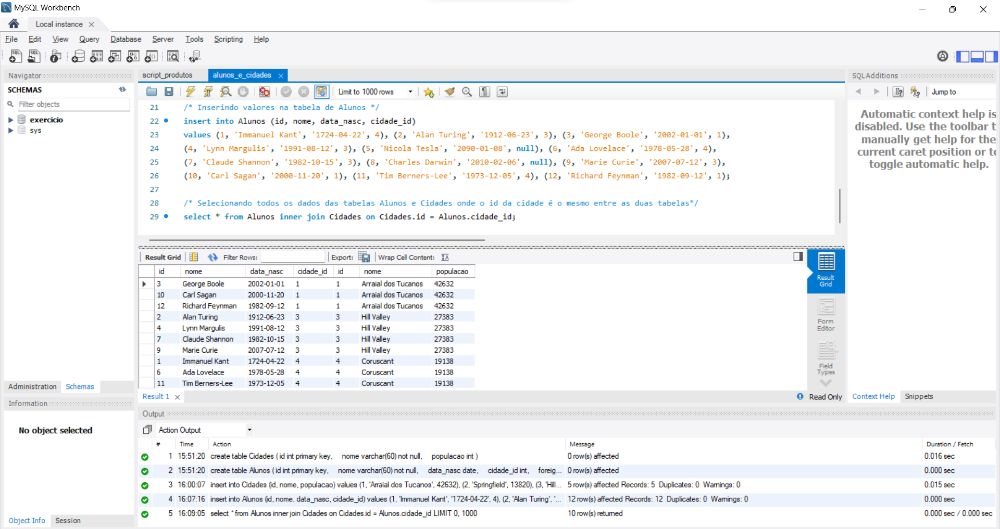

# Atividade individual - Tema: Alunos e Cidades

Crie duas tabelas conforme o modelo apresentado nos slides 61 e 62, no material da AULA 7;

Insira os valores conforme os slides;

Aplique o exemplo sobre inner join dado no slide 67, do material indicado acima.

```
/* Criando tabelas */
create table Cidades (
	id int primary key,
    nome varchar(60) not null,
    populacao int
);

create table Alunos (
	id int primary key,
    nome varchar(60) not null,
    data_nasc date,
    cidade_id int,
    foreign key (cidade_id) references Cidades(id)
);

/* Inserindo valores na tabela de Cidades */
insert into Cidades (id, nome, populacao)
values (1, 'Arraial dos Tucanos', 42632), (2, 'Springfield', 13820), (3, 'Hill Valley', 27383),
(4, 'Coruscant', 19138), (5, 'Minas Tirith', 31394);

/* Inserindo valores na tabela de Alunos */
insert into Alunos (id, nome, data_nasc, cidade_id)
values (1, 'Immanuel Kant', '1724-04-22', 4), (2, 'Alan Turing', '1912-06-23', 3), (3, 'George Boole', '2002-01-01', 1),
(4, 'Lynn Margulis', '1991-08-12', 3), (5, 'Nicola Tesla', '2090-01-08', null), (6, 'Ada Lovelace', '1978-05-28', 4),
(7, 'Claude Shannon', '1982-10-15', 3), (8, 'Charles Darwin', '2010-02-06', null), (9, 'Marie Curie', '2007-07-12', 3),
(10, 'Carl Sagan', '2000-11-20', 1), (11, 'Tim Berners-Lee', '1973-12-05', 4), (12, 'Richard Feynman', '1982-09-12', 1);

/* Selecionando todos os dados das tabelas Alunos e Cidades onde o id da cidade é o mesmo entre as duas tabelas*/
select * from Alunos inner join Cidades on Cidades.id = Alunos.cidade_id;
```

### Print da tela do WorkBench

