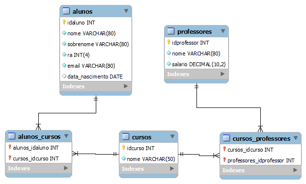
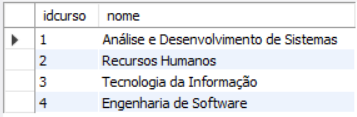
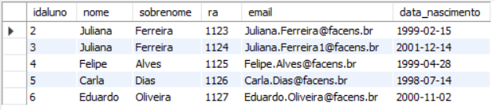

# Atividade individual - Tema: Stored Procedures

Crie um banco de dados para armazenar alunos, cursos e professores de uma
universidade.

Faça a modelagem do banco e identifique as entidades, seus atributos e relacionamentos:



Crie o modelo físico do banco de dados (script SQL):

```
-- MySQL Workbench Forward Engineering

SET @OLD_UNIQUE_CHECKS=@@UNIQUE_CHECKS, UNIQUE_CHECKS=0;
SET @OLD_FOREIGN_KEY_CHECKS=@@FOREIGN_KEY_CHECKS, FOREIGN_KEY_CHECKS=0;
SET @OLD_SQL_MODE=@@SQL_MODE, SQL_MODE='ONLY_FULL_GROUP_BY,STRICT_TRANS_TABLES,NO_ZERO_IN_DATE,NO_ZERO_DATE,ERROR_FOR_DIVISION_BY_ZERO,NO_ENGINE_SUBSTITUTION';

-- -----------------------------------------------------
-- Schema stored_procedures
-- -----------------------------------------------------

-- -----------------------------------------------------
-- Schema stored_procedures
-- -----------------------------------------------------
CREATE SCHEMA IF NOT EXISTS `stored_procedures` DEFAULT CHARACTER SET utf8 ;
USE `stored_procedures` ;

-- -----------------------------------------------------
-- Table `stored_procedures`.`alunos`
-- -----------------------------------------------------
CREATE TABLE IF NOT EXISTS `stored_procedures`.`alunos` (
  `idaluno` INT NOT NULL AUTO_INCREMENT,
  `nome` VARCHAR(80) NOT NULL,
  `sobrenome` VARCHAR(80) NOT NULL,
  `ra` INT(4) NOT NULL,
  `email` VARCHAR(80),
  `data_nascimento` DATE NULL,
  PRIMARY KEY (`idaluno`))
ENGINE = InnoDB;

-- -----------------------------------------------------
-- Table `stored_procedures`.`professores`
-- -----------------------------------------------------
CREATE TABLE IF NOT EXISTS `stored_procedures`.`professores` (
  `idprofessor` INT NOT NULL AUTO_INCREMENT,
  `nome` VARCHAR(80) NOT NULL,
  `salario` DECIMAL(10,2) NOT NULL,
  PRIMARY KEY (`idprofessor`))
ENGINE = InnoDB;


-- -----------------------------------------------------
-- Table `stored_procedures`.`cursos`
-- -----------------------------------------------------
CREATE TABLE IF NOT EXISTS `stored_procedures`.`cursos` (
  `idcurso` INT NOT NULL AUTO_INCREMENT,
  `nome` VARCHAR(50) NOT NULL,
  PRIMARY KEY (`idcurso`))
ENGINE = InnoDB;


-- -----------------------------------------------------
-- Table `stored_procedures`.`alunos_cursos`
-- -----------------------------------------------------
CREATE TABLE IF NOT EXISTS `stored_procedures`.`alunos_cursos` (
  `alunos_idaluno` INT NOT NULL,
  `cursos_idcurso` INT NOT NULL,
  PRIMARY KEY (`alunos_idaluno`, `cursos_idcurso`),
  INDEX `fk_alunos_has_cursos_cursos1_idx` (`cursos_idcurso` ASC) VISIBLE,
  INDEX `fk_alunos_has_cursos_alunos_idx` (`alunos_idaluno` ASC) VISIBLE,
  CONSTRAINT `fk_alunos_has_cursos_alunos`
    FOREIGN KEY (`alunos_idaluno`)
    REFERENCES `stored_procedures`.`alunos` (`idaluno`)
    ON DELETE NO ACTION
    ON UPDATE NO ACTION,
  CONSTRAINT `fk_alunos_has_cursos_cursos1`
    FOREIGN KEY (`cursos_idcurso`)
    REFERENCES `stored_procedures`.`cursos` (`idcurso`)
    ON DELETE NO ACTION
    ON UPDATE NO ACTION)
ENGINE = InnoDB;


-- -----------------------------------------------------
-- Table `stored_procedures`.`cursos_professores`
-- -----------------------------------------------------
CREATE TABLE IF NOT EXISTS `stored_procedures`.`cursos_professores` (
  `cursos_idcurso` INT NOT NULL,
  `professores_idprofessor` INT NOT NULL,
  PRIMARY KEY (`cursos_idcurso`, `professores_idprofessor`),
  INDEX `fk_cursos_has_professores_professores1_idx` (`professores_idprofessor` ASC) VISIBLE,
  INDEX `fk_cursos_has_professores_cursos1_idx` (`cursos_idcurso` ASC) VISIBLE,
  CONSTRAINT `fk_cursos_has_professores_cursos1`
    FOREIGN KEY (`cursos_idcurso`)
    REFERENCES `stored_procedures`.`cursos` (`idcurso`)
    ON DELETE NO ACTION
    ON UPDATE NO ACTION,
  CONSTRAINT `fk_cursos_has_professores_professores1`
    FOREIGN KEY (`professores_idprofessor`)
    REFERENCES `stored_procedures`.`professores` (`idprofessor`)
    ON DELETE NO ACTION
    ON UPDATE NO ACTION)
ENGINE = InnoDB;


SET SQL_MODE=@OLD_SQL_MODE;
SET FOREIGN_KEY_CHECKS=@OLD_FOREIGN_KEY_CHECKS;
SET UNIQUE_CHECKS=@OLD_UNIQUE_CHECKS;

```

Utilize Stored Procedures para automatizar a inserção e seleção dos cursos:
```
delimiter $
create procedure inserirCurso(nome VARCHAR(50))
begin
	insert into cursos values (null, nome);
end$
delimiter ;

delimiter $
create procedure listarCursos()
begin
	select * from cursos;
end$
delimiter ;
```


O aluno possui um email que deve ter seu endereço gerado automaticamente no seguinte formato:
nome.sobrenome@dominio.com
/ Como fica o email se duas pessoas tiverem o mesmo nome e sobrenome?
```
delimiter $
create trigger gerarEmail before insert on alunos for each row
begin
	declare contadorEmail int;
	set contadorEmail = 0;
  
	select count(*) into contadorEmail from alunos where email = CONCAT(NEW.nome, '.', NEW.sobrenome, '@facens.br');
  
	if contadorEmail > 0 then
		set NEW.email = CONCAT(NEW.nome, '.', NEW.sobrenome, contadorEmail, '@facens.br');
	else
		set NEW.email = CONCAT(NEW.nome, '.', NEW.sobrenome, '@facens.br');
	end if;
end $
delimiter ;

delimiter $
create procedure inserirAluno(nome VARCHAR(80), sobrenome VARCHAR(80), ra INT(4), data_nascimento DATE)
begin
	insert into alunos(nome, sobrenome, ra, data_nascimento) values (nome, sobrenome, ra, data_nascimento);
end$
delimiter ;

delimiter $
create procedure listarAlunos()
begin
	select * from alunos;
end$
delimiter ;
```

