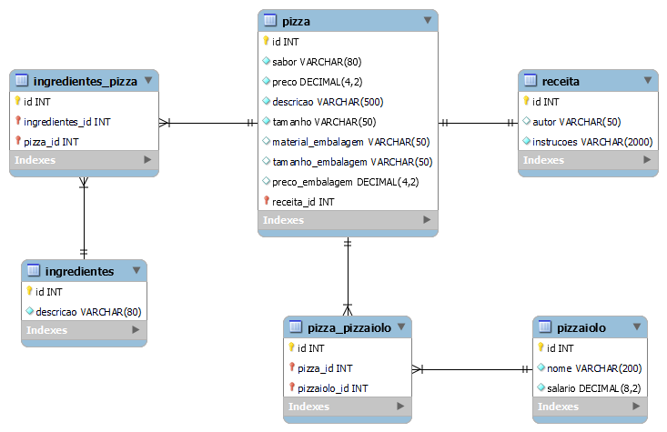
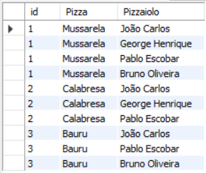
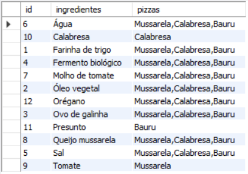

# Atividade individual - Tema: Pizzaria

Observe o modelo conceitual no slide 17 da AULA 9 e execute as seguintes etapas:

Transforme o modelo conceitual em modelo lógico:



Escreva o script SQL que cria o banco de dados:

```
CREATE DATABASE pizzaria;
USE pizzaria;

CREATE TABLE receita (
  id INT NOT NULL AUTO_INCREMENT PRIMARY KEY,
  autor VARCHAR(50),
  instrucoes VARCHAR(2000) NOT NULL
);

CREATE TABLE pizza (
  id INT NOT NULL AUTO_INCREMENT PRIMARY KEY,
  sabor VARCHAR(80) NOT NULL,
  preco DECIMAL(4,2) NOT NULL,
  descricao VARCHAR(500) NOT NULL,
  tamanho VARCHAR(50) NOT NULL,
  material_embalagem VARCHAR(50),
  tamanho_embalagem VARCHAR(50),
  preco_embalagem DECIMAL(4,2),
  receita_id INT NOT NULL,
  FOREIGN KEY (receita_id) REFERENCES receita(id)
);

CREATE TABLE ingredientes (
  id INT NOT NULL AUTO_INCREMENT PRIMARY KEY,
  descricao VARCHAR(80) NOT NULL
);

CREATE TABLE ingredientes_pizza (
  id INT NOT NULL AUTO_INCREMENT PRIMARY KEY,
  ingredientes_id INT NOT NULL,
  pizza_id INT NOT NULL,
  FOREIGN KEY (ingredientes_id) REFERENCES ingredientes(id),
  FOREIGN KEY (pizza_id) REFERENCES pizza(id)
  );

CREATE TABLE pizzaiolo (
  id INT NOT NULL AUTO_INCREMENT PRIMARY KEY,
  nome VARCHAR(200) NOT NULL,
  salario DECIMAL(8,2) NOT NULL
);

CREATE TABLE pizza_pizzaiolo (
  id INT NOT NULL AUTO_INCREMENT PRIMARY KEY,
  pizza_id INT NOT NULL,
  pizzaiolo_id INT NOT NULL,
  FOREIGN KEY (pizza_id) REFERENCES pizza(id),
  FOREIGN KEY (pizzaiolo_id) REFERENCES pizzaiolo(id)
);
```

Insira dados no banco criado:

```
INSERT INTO receita (autor, instrucoes)
	VALUES ('Ana Helena', 'Junte todos os ingredientes da massa e misture.
    Deixe descasar até que dobre de tamanho e asse em forno pré-aquecido.
    Acomode a massa em uma forma de pizza, de preferência redonda.
    O recheio deve ser colocado na seguinte ordem: molho de tomate, queijo mussarela, rodelas de tomate e orégano.
    Deixe assar por 20 minutos em fogo médio ou até que a massa fique crocante.'),
    ('Juliano Torres', 'Junte todos os ingredientes da massa e misture.
    Deixe descasar até que dobre de tamanho e asse em forno pré-aquecido.
    Acomode a massa em uma forma de pizza, de preferência redonda.
    O recheio deve ser colocado na seguinte ordem: molho de tomate, queijo mussarela, rodelas de calabresa e orégano.
    Deixe assar por 20 minutos em fogo médio ou até que a massa fique crocante.'),
    ('Joana Dias', 'Junte todos os ingredientes da massa e misture.
    Deixe descasar até que dobre de tamanho e asse em forno pré-aquecido.
    Acomode a massa em uma forma de pizza, de preferência redonda.
    O recheio deve ser colocado na seguinte ordem: molho de tomate, queijo mussarela, presunto ralado e orégano.
    Deixe assar por 20 minutos em fogo médio ou até que a massa fique crocante.');

INSERT INTO ingredientes (descricao)
	VALUES ('Farinha de trigo'), ('Óleo vegetal'), ('Ovo de galinha'), ('Fermento biológico'),
    ('Sal'), ('Água'), ('Molho de tomate'), ('Queijo mussarela'), ('Tomate'),  ('Calabresa'),
    ('Presunto'), ('Orégano'), ('Cebola'), ('Frango desfiado');

INSERT INTO pizza (sabor, preco, descricao, tamanho, material_embalagem, tamanho_embalagem, preco_embalagem, receita_id)
	VALUES ('Mussarela', 19.90, 'Molho de tomate, queijo mussarela, rodelas de tomate e orégano.', 'Média', 'Papel', 'Caixa média', 2.50, 1),
    ('Calabresa', 23.90, 'Molho de tomate, queijo mussarela, rodelas de calabresa e orégano.', 'Média', 'Papel', 'Caixa média', 2.50, 2),
    ('Bauru', 21.90, 'Molho de tomate, queijo mussarela, presunto ralado e orégano.', 'Média', 'Papel', 'Caixa média', 2.50, 3);

INSERT INTO ingredientes_pizza (ingredientes_id, pizza_id)
	VALUES (1, 1), (2, 1), (3, 1), (4, 1), (5, 1), (6, 1), (7, 1), (8, 1), (9, 1), (12, 1),
    (1, 2), (2, 2), (3, 2), (4, 2), (5, 2), (6, 2), (7, 2), (8, 2), (10, 2), (12, 2),
    (1, 3), (2, 3), (3, 3), (4, 3), (5, 3), (6, 3), (7, 3), (8, 3), (11, 3), (12, 3);

INSERT INTO pizzaiolo (nome, salario)
	VALUES ('João Carlos', 1780.00), ('George Henrique', 1650.00), ('Pablo Escobar', 1780.00), ('Bruno Oliveira', 1650.00);

INSERT INTO pizza_pizzaiolo (pizza_id, pizzaiolo_id)
	VALUES (1, 1), (1, 2), (1, 3), (1, 4), (2, 1), (2, 2), (2, 3), (3, 1), (3, 3), (3, 4);
```

Crie um relatório com todas as pizzas e os pizzaiolos aptos a produzi-las:
```
SELECT pizza.id, pizza.sabor as Pizza, pizzaiolo.nome as Pizzaiolo FROM pizza 
INNER JOIN pizza_pizzaiolo on pizza.id = pizza_pizzaiolo.pizza_id
INNER JOIN pizzaiolo on pizza_pizzaiolo.pizzaiolo_id = pizzaiolo.id;
```


Crie um relatório com todas as pizzas e seus ingredientes:
```
SELECT pizza.sabor, group_concat(ingredientes.descricao) as ingredientes FROM pizza
INNER JOIN ingredientes_pizza on pizza.id =  ingredientes_pizza.pizza_id
INNER JOIN ingredientes on ingredientes_pizza.ingredientes_id = ingredientes.id
GROUP BY pizza.sabor;
```


Crie um relatório com todos os ingredientes e as pizzas onde são utilizados:
```
SELECT ingredientes.id, ingredientes.descricao as ingredientes, group_concat(pizza.sabor) as pizzas FROM ingredientes
INNER JOIN ingredientes_pizza on ingredientes.id = ingredientes_pizza.ingredientes_id
INNER JOIN pizza on ingredientes_pizza.pizza_id = pizza.id
GROUP BY ingredientes.descricao;
```


Crie um relatório com os sabores de todas as pizzas, o nome dos pizzaiolos que as fazem e as instruções para produzi-las:
```
SELECT pizza.sabor, group_concat(pizzaiolo.nome) as nome_pizzaiolos, receita.instrucoes from pizza
INNER JOIN pizza_pizzaiolo on pizza.id = pizza_pizzaiolo.pizza_id
INNER JOIN pizzaiolo on pizza_pizzaiolo.pizzaiolo_id = pizzaiolo.id
INNER JOIN receita on receita.id = pizza.receita_id
GROUP BY pizza.sabor;
```

