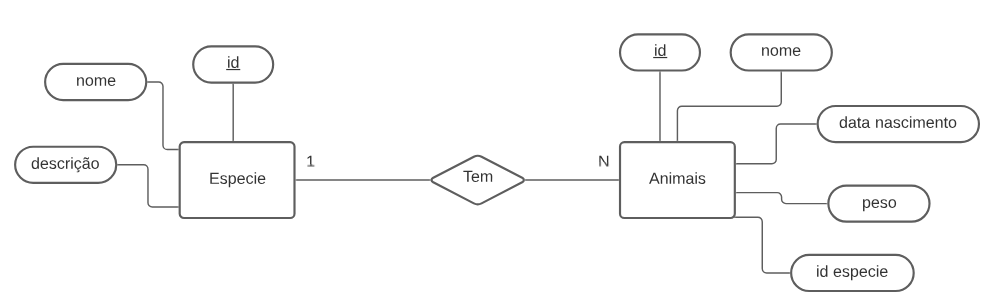
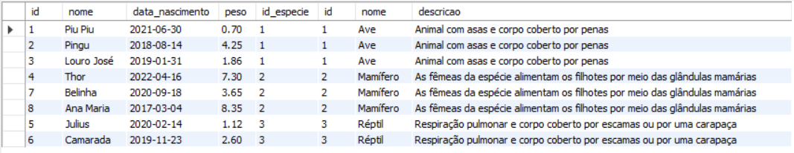
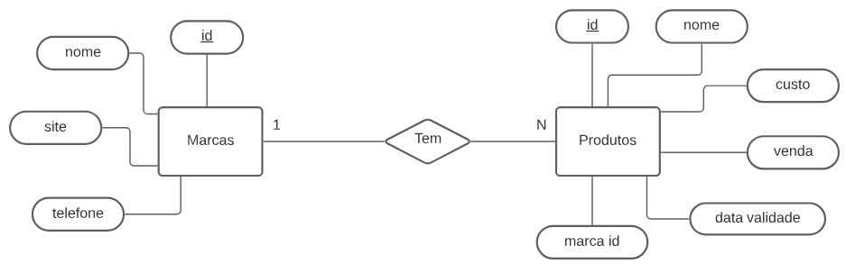
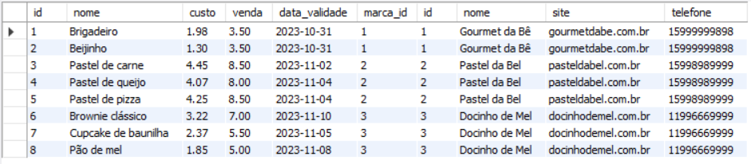
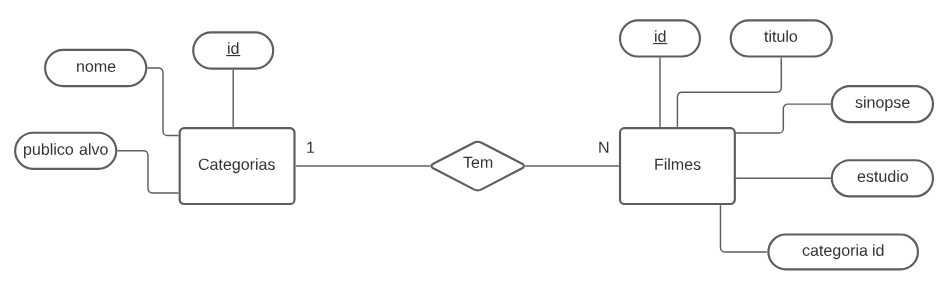
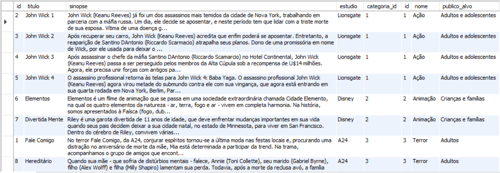

# Atividade individual - Tema: Base de Dados

### Etapa 1

Crie a tabela animais, conforme o exemplo demonstrado, durante a aula do dia 11/09/23;

Insira todos os valores disponíveis no slide 8:

```
CREATE TABLE animais (
  id int,
  nome varchar(50),
  nasc date,
  peso decimal(10,2),
  cor varchar (50)
);
  
INSERT INTO animais (id, nome, nasc, peso, cor) 
VALUES (01, 'Ágata', '2015-04-09', 13.9, 'branco'), (02, 'Félix', '2016-06-06', 14.3, 'preto'),
(03, 'Tom', '2013-02-08', 11.2, 'azul'), (04, 'Garfield', '2015-07-06', 17.1, 'laranja'),
(05, 'Frajola', '2013-08-01', 13.7, 'preto'), (06, 'Manda-chuva', '2012-02-03', 12.3, 'amarelo'),
(07, 'Snowball', '2014-04-06', 13.2, 'preto'), (10, 'Ágata', '2015-08-03', 11.9, 'azul'),
(11, 'Gato de Botas', '2012-12-10', 11.6, 'amarelo'), (12, 'Kitty', '2020-04-06', 11.6, 'amarelo'),
(13, 'Milu', '2013-02-04', 17.9, 'branco'), (14, 'Pluto', '2012-01-03', 12.3, 'amarelo'),
(15, 'Pateta', '2015-05-01', 17.7, 'preto'), (16, 'Snoopy', '2013-07-02', 18.2, 'branco'),
(17, 'Rex', '2019-11-03', 19.7, 'beje'), (20, 'Bidu', '2012-09-08', 12.4, 'azul'),
(21, 'Dum Dum', '2015-04-06', 11.2, 'laranja'), (22, 'Muttley', '2011-02-03', 14.3, 'laranja'),
(23, 'Scooby', '2012-01-02', 19.9, 'marrom'), (24, 'Rufus', '2014-04-05', 19.7, 'branco'),
(25, 'Rex', '2021-08-19', 19.7, 'branco');

```

Selecione todos os animais
```
SELECT * FROM animais;
```

Selecione todos os animais que pesam menos que 13.1
```
SELECT * FROM animais WHERE peso < 13.1;
```

Selecione todos nasceram entre fevereiro e dezembro de 2015
```
SELECT * FROM animais WHERE nasc BETWEEN '2015-02-01' AND '2015-12-31';
```

Selecione todos os animais brancos que pesam menos que 15.0
```
SELECT * FROM animais WHERE cor = 'branco' AND peso < 15.0;
```

Selecione nome, cor e peso de todos cujo nome comece com ’B’
```
SELECT nome, cor, peso FROM animais WHERE nome LIKE 'B%';
```

Selecione nome, cor e peso de todos com cor vermelha, amarela, marrom e laranja
```
SELECT nome, cor, peso FROM animais WHERE cor in ('vermelho', 'amarelo', 'marrom', 'laranja');
```

Selecione nome, cor, data de nascimento e peso de todos ordenados pelos mais jovens
```
SELECT nome, cor, nasc, peso FROM animais ORDER BY nasc DESC;
```

Selecione todos os animais cujo nome comece com 'C' e não sejam brancos
```
SELECT * FROM animais WHERE nome LIKE 'C%' AND cor != 'branco';
```

Selecione todos os animais cujo nome contenha 'ba'
```
SELECT * FROM animais WHERE nome LIKE '%ba%';
```

Selecione todos os animais com peso entre 13.0 à 15.0
```
SELECT * FROM animais WHERE peso BETWEEN 13.0 and 15.0;
```

Selecione todos os animais que o peso não seja maior que 30, com cor amarelo ou roxo e nascidos depois de 2012
```
SELECT * FROM animais WHERE peso < 30 and cor in ('amarelo', 'roxo') and nasc >= '2013-01-01';
```

### Etapa 2

1 - Crie um banco de dados para armazenar dados de Animais e Espécies. Um animal tem seu nome, data_nasc e peso. Uma espécie tem um nome e uma descrição.

Faça a modelagem relacional, DER.

Insira pelo menos 8 animais e 3 espécies.



```
CREATE DATABASE reino_animal;
USE reino_animal;

CREATE TABLE animais (
  id integer PRIMARY KEY AUTO_INCREMENT,
  nome varchar (50) NOT NULL,
  data_nascimento date,
  peso decimal (6,2) CHECK (peso > 0),
  id_especie int,
  FOREIGN KEY(id_especie) REFERENCES especie(id)
);

CREATE TABLE especie (
  id integer PRIMARY KEY AUTO_INCREMENT,
  nome varchar (60) NOT NULL,
  descricao varchar (200)
);

INSERT INTO especie (nome, descricao)
VALUES ('Ave', 'Animal com asas e corpo coberto por penas'),
('Mamífero', 'As fêmeas da espécie alimentam os filhotes por meio das glândulas mamárias'),
('Réptil', 'Respiração pulmonar e corpo coberto por escamas ou por uma carapaça');

INSERT INTO animais (nome, data_nascimento, peso, id_especie) 
VALUES ('Piu Piu', '2021-06-30', 0.7, 1),
('Pingu', '2018-08-14', 4.25, 1),
('Louro José', '2019-01-31', 1.86, 1),
('Thor', '2022-04-16', 7.3, 2),
('Julius', '2020-02-14', 1.12, 3),
('Camarada', '2019-11-23', 2.60, 3),
('Belinha', '2020-09-18', 3.65, 2),
('Ana Maria', '2017-03-04', 8.35, 2);
  
SELECT * FROM animais a INNER JOIN especie e on e.id = a.id_especie;
```


2 - Crie um banco de dados para registrar dados de Produtos e Marcas. Um produto deve ter nome, preço de custo, preço de venda, data de validade e marca. Uma marca deve ter, nome, site oficial e telefone.

Faça a modelagem relacional, DER.

Insira pelo menos 8 Produtos e 3 Marcas.



```
create database produtos_marcas;
use produtos_marcas;

create table marcas (
	id int auto_increment primary key,
    nome varchar(50) not null,
    site varchar(200),
    telefone varchar(11)
);

create table produtos (
	id int auto_increment primary key,
    nome varchar(50) not null,
    custo decimal(10,2),
    venda decimal(10,2),
    data_validade date,
    marca_id int,
    constraint fk_marcas foreign key(marca_id) references marcas(id)
);

insert into marcas (nome, site, telefone)
values ('Gourmet da Bê', 'gourmetdabe.com.br', '15999999898'),
('Pastel da Bel', 'pasteldabel.com.br', '15998989999'), ('Docinho de Mel', 'docinhodemel.com.br', '11996669999');

insert into produtos (nome, custo, venda, data_validade, marca_id)
values ('Brigadeiro', 1.98, 3.50, '2023-10-31', 1), ('Beijinho', 1.30, 3.50, '2023-10-31', 1),
('Pastel de carne', 4.45, 8.50, '2023-11-02', 2), ('Pastel de queijo', 4.07, 8.00, '2023-11-04', 2),
('Pastel de pizza', 4.25, 8.50, '2023-11-04', 2), ('Brownie clássico', 3.22, 7.00, '2023-11-10', 3),
('Cupcake de baunilha', 2.37, 5.50, '2023-11-05', 3), ('Pão de mel', 1.85, 5.00, '2023-11-08', 3);

select * from produtos p join marcas m on m.id = p.marca_id;
```


3 - Crie um banco de dados para registrar dados de Filmes e Categorias. Um filme tem seu título, sinopse, estudio e categoria. Uma categoria deve ter nome e público alvo.

Faça a modelagem relacional, DER.

Insira pelo menos 8 Filmes e 3 Categorias.



```
create database locadora;
use locadora;

create table categorias (
	id int primary key auto_increment,
    nome varchar(50) not null,
    publico_alvo varchar(50)
);

create table filmes (
	id int primary key auto_increment,
    titulo varchar(200) not null,
    sinopse varchar(5000),
    estudio varchar(80),
    categoria_id int,
    constraint fk_categorias foreign key(categoria_id) references categorias(id)
);

insert into categorias (nome, publico_alvo)
values ('Ação', 'Adultos e adolescentes'), ('Animação', 'Crianças e famílias'), ('Terror', 'Adultos');

insert into filmes ( titulo, sinopse, estudio, categoria_id)
values ('Fale Comigo', 'No terror Fale Comigo, da A24, conjurar espíritos tornou-se a última moda nas festas locais e, procurando uma distração no aniversário de morte da mãe, Mia está determinada a participar da trend. Na trama, acompanhamos o grupo de amigos que encontra uma misteriosa mão embalsamada e descobre que ela permite invocar espíritos. Como é de se esperar, todos ficam muito empolgados com a nova descoberta, mas não demora muito até que a brincadeira tome um rumo extremamente perigoso quando um deles acaba indo longe demais e, por acidente, abre uma porta para o mundo espiritual. Agora, com todos altamente vulneráveis a várias ameaças aterrorizantes, cada um dos amigos será obrigado a lidar com uma difícil escolha, descobrindo em quem devem confiar: nos mortos da outra dimensão ou nos vivos. Protagonizado por Sophie Wilde, Miranda Otto, Alexandra Jensen, Joe Bird, Otis Djanji e Zoe Terakes, o filme é dirigido pela dupla de estreantes em longas-metragens, Danny e Michael Philippou.', 'A24', 3),
('John Wick 1', 'John Wick (Keanu Reeves) já foi um dos assassinos mais temidos da cidade de Nova York, trabalhando em parceria com a máfia russa. Um dia, ele decide se aposentar, e neste período tem que lidar com a triste morte de sua esposa. Vítima de uma doença grave, ela já previa a sua própria morte, e deu de presente ao marido um cachorro para cuidar em seu período de luto. No entanto, poucos dias após o funeral, o cachorro é morto por ladrões que roubam o seu carro. John Wick parte em busca de vingança contra estes homens que ele já conhecia muito bem, e que roubaram o último símbolo da mulher que ele amava.', 'Lionsgate', 1),
('John Wick 2', 'Após recuperar seu carro, John Wick (Keanu Reeves) acredita que enfim poderá se aposentar. Entretanto, a reaparição de Santino DAntonio (Riccardo Scarmacio) atrapalha seus planos. Dono de uma promissória em nome de Wick, por ele usada para deixar o posto de assassino profissional da Alta Cúpula, Santino cobra a dívida existente e insiste para que ele mate sua própria irmã, Gianna (Claudia Gerini).', 'Lionsgate', 1),
('John Wick 3', 'Após assassinar o chefe da máfia Santino DAntonio (Riccardo Scamarcio) no Hotel Continental, John Wick (Keanu Reeves) passa a ser perseguido pelos membros da Alta Cúpula sob a recompensa de U$14 milhões. Agora, ele precisa unir forças com antigos parceiros que o ajudaram no passado enquanto luta por sua sobrevivência.', 'Lionsgate', 1),
('John Wick 4', 'O assassino profissional retorna às telas para John Wick 4: Baba Yaga. O assassino profissional John Wick (Keanu Reeves) agora virou metade do submundo contra ele com sua vingança, que agora está entrando em sua quarta rodada em Nova York, Berlim, Paris e Osaka. Sua equipe, composta por Bowery King (Laurence Fishburne), o gerente do hotel Winston (Ian McShane) e o concierge Charon (Lance Reddick) do lendário hotel assassino Continental, novamente fazem parte da festa. No entanto, as chances de escapar desta vez parecem quase impossíveis, pois o maior inimigo está surgindo. O implacável chefe do submundo Marquis de Gramont (Bill Skarsgård), que tem alianças inteiras atrás dele, representa a maior e sanguinária ameaça até hoje. Mas seus capangas também são durões, incluindo Shimazu (Hiroyuki Sanada) e Killa (Scott Adkins) localizados. Felizmente, existem velhos aliados como Caine (Donnie Yen) que correm para ajudar Wick. Não há caminho de volta, só um sobrevive.', 'Lionsgate', 1),
('Elementos', 'Elementos é um filme de animação que se passa em uma sociedade extraordinária chamada Cidade Elemento, na qual os quatro elementos da natureza - ar, terra, fogo e ar - vivem em completa harmonia. Na história, somos apresentados à Faísca (fogo, dublada por Leah Lewis), uma mulher espirituosa na faixa dos vinte anos, com um grande senso de humor e apaixonada pela família, mas que tem um temperamento um pouco quente; Gota (água, dublado por Mamoudou Athie) é um jovem empático, observador e extrovertido, que não tem medo de demonstrar suas emoções - na verdade, é até um pouco difícil controlá-las; Turrão (terra, dublado por Mason Wertheimer) é um garoto muito inteligente da terra que mora na Vila do Fogo, e está sempre perto de Faísca; e Névoa (ar, dublada por Wendi McLendon-Covey), que tem uma personalidade fofa e rosa, está sempre atenta às tendências da moda e é fã dos Windbreakers, um time de Air Ball.', 'Disney', 2),
('Divertida Mente', 'Riley é uma garota divertida de 11 anos de idade, que deve enfrentar mudanças importantes em sua vida quando seus pais decidem deixar a sua cidade natal, no estado de Minnesota, para viver em San Francisco. Dentro do cérebro de Riley, convivem várias emoções diferentes, como a Alegria, o Medo, a Raiva, o Nojinho e a Tristeza. A líder deles é Alegria, que se esforça bastante para fazer com que a vida de Riley seja sempre feliz. Entretanto, uma confusão na sala de controle faz com que ela e Tristeza sejam expelidas para fora do local. Agora, elas precisam percorrer as várias ilhas existentes nos pensamentos de Riley para que possam retornar à sala de controle - e, enquanto isto não acontece, a vida da garota muda radicalmente.', 'Disney', 2),
('Hereditário', 'Quando sua mãe - que sofria de distúrbios mentais - falece, Annie (Toni Collette), seu marido (Gabriel Byrne), filho (Alex Wolff) e filha (Milly Shapiro) lamentam sua perda. Todavia, após a morte da reclusa avó, a família Graham começa a desvendar algumas coisas. A família recorre a diferentes meios para lidar com sua dor, incluindo Annie e sua filha flertando com o sobrenatural. Mesmo após a partida da matriarca, ela permanece como se fosse um sombra sobre a família, especialmente sobre a solitária neta adolescente, Charlie, por quem ela sempre manteve uma fascinação não usual. Com um crescente terror tomando conta da casa, a família explora lugares mais obscuros para escapar do infeliz destino que herdaram. Cada um deles começa a ter experiências perturbadoras e sobrenaturais ligadas aos segredos sinistros e traumas emocionais que passaram pelas gerações de sua família.', 'A24', 3);

select * from filmes f join categorias c on c.id = f.categoria_id;
```

