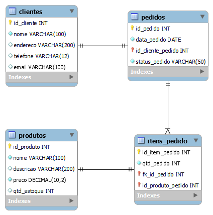
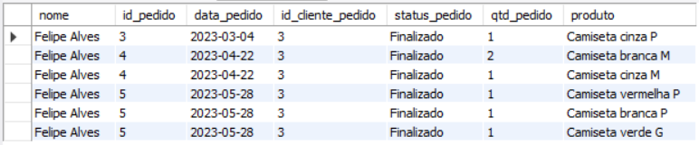
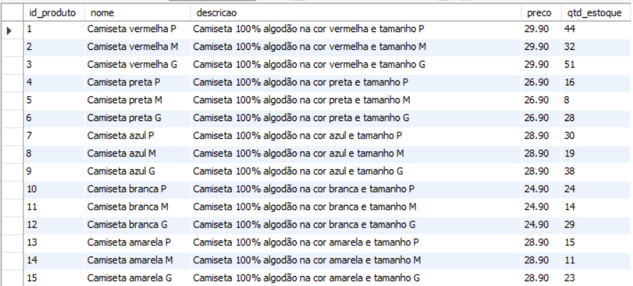

# Atividade individual - Tema: Comércio Eletrônico

### Modelo lógico


#### Tabelas:

Produtos: Armazene informações sobre produtos, como nome, descrição, preço e quantidade em estoque.
```
CREATE TABLE produtos (
  id_produto INT PRIMARY KEY AUTO_INCREMENT,
  nome VARCHAR(100) NOT NULL,
  descricao VARCHAR(200) NULL,
  preco DECIMAL(10,2) NOT NULL,
  qtd_estoque INT DEFAULT 0
);
```

Pedidos: Registre detalhes de pedidos, incluindo data, cliente e status.
```
CREATE TABLE pedidos (
	id_pedido INT PRIMARY KEY AUTO_INCREMENT,
    data_pedido DATE NOT NULL,
    id_cliente_pedido INT REFERENCES clientes(id_cliente),
    status_pedido VARCHAR(50) NOT NULL
);
```

Clientes: Mantenha informações dos clientes, como nome, endereço de entrega e informações de contato.
```
CREATE TABLE clientes (
  id_cliente INT PRIMARY KEY AUTO_INCREMENT,
  nome VARCHAR(100) NOT NULL,
  endereco VARCHAR(200) NULL,
  telefone VARCHAR(12) NULL,
  email VARCHAR(100) NULL
);
```

Itens de Pedido: Registre os produtos incluídos em cada pedido, junto com a quantidade.
```
CREATE TABLE itens_pedido (
  id_item_pedido INT PRIMARY KEY AUTO_INCREMENT,
  fk_id_pedido INT REFERENCES pedidos(id_pedido),
  id_produto_pedido INT REFERENCES produtos(id_produto),
  qtd_pedido INT DEFAULT 0
);
```

#### Relacionamentos:

Crie um relacionamento entre "Pedidos" e "Clientes" para rastrear os pedidos de cada cliente.

Estabeleça um relacionamento entre "Itens de Pedido" e "Produtos" para associar produtos a pedidos.

Insira no mínimo 20 dados em cada tabela criada para o exercício.
```
INSERT INTO produtos (nome, descricao, preco, qtd_estoque)
VALUES ('Camiseta vermelha P', 'Camiseta 100% algodão na cor vermelha e tamanho P', 29.90, 44),
('Camiseta vermelha M', 'Camiseta 100% algodão na cor vermelha e tamanho M', 29.90, 32),
('Camiseta vermelha G', 'Camiseta 100% algodão na cor vermelha e tamanho G', 29.90, 51),
('Camiseta preta P', 'Camiseta 100% algodão na cor preta e tamanho P', 26.90, 16),
('Camiseta preta M', 'Camiseta 100% algodão na cor preta e tamanho M', 26.90, 8),
('Camiseta preta G', 'Camiseta 100% algodão na cor preta e tamanho G', 26.90, 28),
('Camiseta azul P', 'Camiseta 100% algodão na cor azul e tamanho P', 28.90, 30),
('Camiseta azul M', 'Camiseta 100% algodão na cor azul e tamanho M', 28.90, 19),
('Camiseta azul G', 'Camiseta 100% algodão na cor azul e tamanho G', 28.90, 38),
('Camiseta branca P', 'Camiseta 100% algodão na cor branca e tamanho P', 24.90, 24),
('Camiseta branca M', 'Camiseta 100% algodão na cor branca e tamanho M', 24.90, 14),
('Camiseta branca G', 'Camiseta 100% algodão na cor branca e tamanho G', 24.90, 29),
('Camiseta amarela P', 'Camiseta 100% algodão na cor amarela e tamanho P', 28.90, 15),
('Camiseta amarela M', 'Camiseta 100% algodão na cor amarela e tamanho M', 28.90, 11),
('Camiseta amarela G', 'Camiseta 100% algodão na cor amarela e tamanho G', 28.90, 23),
('Camiseta verde P', 'Camiseta 100% algodão na cor verde e tamanho P', 26.90, 42),
('Camiseta verde M', 'Camiseta 100% algodão na cor verde e tamanho M', 26.90, 31),
('Camiseta verde G', 'Camiseta 100% algodão na cor verde e tamanho G', 26.90, 56),
('Camiseta cinza P', 'Camiseta 100% algodão na cor cinza e tamanho P', 24.90, 18),
('Camiseta cinza M', 'Camiseta 100% algodão na cor cinza e tamanho M', 24.90, 7),
('Camiseta cinza G', 'Camiseta 100% algodão na cor cinza e tamanho G', 24.90, 20);

INSERT INTO clientes (nome, endereco, telefone, email)
VALUES ('Ana Clara', 'Rua das Flores, 44', '1599999-9999', 'ana.clara@email.com'),
('Amanda Moraes', 'Rua das Plantas, 101', '1599999-9998', 'amanda.moraes@email.com'),
('Felipe Alves', 'Rua Francisco, 472', '1599999-9997', 'felipe.alves@email.com'),
('Julia Camargo', 'Rua do Amor, 52', '1599999-9996', 'julia.camargo@email.com'),
('Vanessa Ferreira', 'Rua das Árvores, 258', '1599999-9995', 'vanessa.ferreira@email.com'),
('Caique Silva', 'Rua do Sol, 78', '1599999-9994', 'caique.silva@email.com'),
('Andre Felipe', 'Rua da Lua, 90', '1599999-9993', 'andres.felipe@email.com'),
('Willian dos Santos', 'Rua do Mar, 431', '1599999-9992', 'will.santos@email.com'),
('Teruo Yamasaka', 'Rua do Oceano, 17', '1599999-9991', 'teruo.yamasaka@email.com'),
('Yasmin Souza', 'Rua da Grama, 62', '1599999-9990', 'yasmin.souza@email.com'),
('Debora Aladim', 'Rua do Tronco, 59', '1599999-9989', 'debora.aladim@email.com'),
('Henrique Oliveira', 'Rua do Anel, 334', '1599999-9988', 'henrique.oliveira@email.com'),
('Vinicius Ferreira', 'Alameda Franca, 71', '1599999-9987', 'vinicius.ferreira@email.com'),
('Cristian Mateus', 'Rua das Estrelas, 10', '1599999-9986', 'cristian.mateus@email.com'),
('José Reginaldo', 'Rua dos Planetas, 89', '1599999-9985', 'jose.reginaldo@email.com'),
('Elena Nunes', 'Rua de Pedras, 465', '1599999-9984', 'elena.nunes@email.com'),
('Luan Felipe', 'Rua das Fontes, 741', '1599999-9983', 'luan.felipe@email.com'),
('Ana Cristina', 'Rua do Carinho, 152', '1599999-9982', 'ana.cristina@email.com'),
('Barbara Cardoso', 'Rua das Nuvens, 37', '1599999-9981', 'barbara.cardoso@email.com'),
('Kevin Pereira', 'Rua do Céu, 92', '1599999-9980', 'kevin.pereira@email.com');

INSERT INTO pedidos (data_pedido, id_cliente_pedido, status_pedido)
VALUES ('2023-02-15', 1, 'Finalizado'), ('2023-06-11', 2, 'Finalizado'),
('2023-03-04', 3, 'Finalizado'), ('2023-04-22', 3, 'Finalizado'), ('2023-05-28', 3, 'Finalizado'),
('2023-07-01', 4, 'Finalizado'), ('2023-10-29', 5, 'NFe emitida'), ('2023-09-14', 6, 'Finalizado'),
('2023-10-03', 7, 'Finalizado'), ('2023-10-28', 7, 'Em separação'), ('2023-08-20', 10, 'Finalizado'),
('2023-04-04', 11, 'Finalizado'), ('2023-05-17', 12, 'Finalizado'), ('2023-10-27', 15, 'Pedido enviado'),
('2023-10-15', 16, 'Finalizado'), ('2023-09-28', 17, 'Finalizado'), ('2023-08-03', 19, 'Finalizado'), 
('2023-10-28', 19, 'Pedido enviado'), ('2023-06-26', 20, 'Finalizado'), ('2023-10-26', 20, 'Em rota de entrega');

INSERT INTO itens_pedido (fk_id_pedido, id_produto_pedido, qtd_pedido)
VALUES (1, 14, 1), (1, 2, 2), (2, 3, 1), (3, 19, 1), (4, 11, 2), (4, 20, 1), 
(5, 1, 1), (5, 10, 1), (5, 18, 1), (6, 4, 2), (7, 4, 1), (8, 7, 1), (9, 11, 3), 
(10, 16, 2), (10, 17, 1), (11, 17, 4), (12, 3, 3), (12, 5, 1), (13, 9, 1), (14, 15, 2), 
(15, 1, 1), (16, 13, 2), (16, 17, 1), (16, 20, 2), (17, 19, 1), (18, 2, 1), (19, 6, 1), 
(19, 8, 2), (19, 11, 1), (19, 12, 1), (20, 10, 1), (20, 17, 1), (20, 18, 2), (20, 20, 1);
```

#### Stored Procedures:

Implemente uma stored procedure para permitir que os clientes adicionem produtos ao carrinho de compras.
```
delimiter $
CREATE PROCEDURE carrinho_de_compras (id_cliente INT, id_produto INT, quantidade INT)
BEGIN
	INSERT INTO pedidos VALUES (NULL, NOW(), id_cliente, 'Pedido criado');
    INSERT INTO itens_pedido VALUES (NULL, (SELECT MAX(id_pedido) FROM pedidos), id_produto, quantidade);
END$
delimiter ;
```

Desenvolva uma stored procedure para calcular o total de um pedido com base nos produtos incluídos.
```
delimiter $
CREATE PROCEDURE valor_do_pedido (id_pedido INT)
BEGIN
	SELECT SUM(pd.preco * ip.qtd_pedido) AS valor_total FROM pedidos p
		LEFT JOIN itens_pedido ip ON ip.fk_id_pedido = p.id_pedido
		LEFT JOIN produtos pd ON pd.id_produto = ip.id_produto_pedido
		WHERE p.id_pedido = id_pedido;
END$
delimiter ;
```

#### Views:

Crie uma view que mostre o histórico de pedidos de um cliente específico, incluindo os produtos incluídos em cada pedido.
```
CREATE VIEW historico_pedidos AS
SELECT c.nome, p.*, ip.qtd_pedido, pd.nome AS produto FROM clientes c
	INNER JOIN pedidos p ON c.id_cliente = p.id_cliente_pedido
	RIGHT JOIN itens_pedido ip ON ip.fk_id_pedido = p.id_pedido
    RIGHT JOIN produtos pd ON pd.id_produto = ip.id_produto_pedido
	WHERE c.id_cliente = 3;
```



Implemente uma view que forneça uma lista de todos os produtos disponíveis, excluindo aqueles que estão esgotados.
```
CREATE VIEW produtos_disponiveis AS
SELECT * FROM produtos WHERE qtd_estoque > 0;
```

