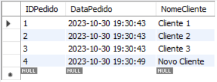
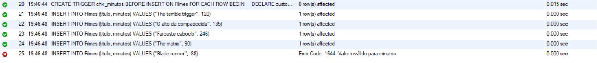
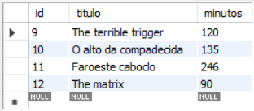
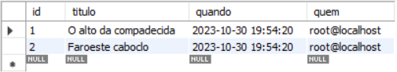

# Atividade individual - Tema: Trigger

REPRODUZA O PRIMEIRO CÓDIGO SUGERIDO NO MYSQL WORKBENCH.
EXECUTE AS ETAPAS E VERIFIQUE SEUS RESULTADOS.
```
CREATE DATABASE atividade_trigger;
USE atividade_trigger;

CREATE TABLE Pedidos (
	IDPedido INT AUTO_INCREMENT PRIMARY KEY,
	DataPedido DATETIME,
	NomeCliente VARCHAR(100)
);

INSERT INTO Pedidos (DataPedido, NomeCliente) VALUES
(NOW(), 'Cliente 1'),
(NOW(), 'Cliente 2'),
(NOW(), 'Cliente 3');

DELIMITER $
CREATE TRIGGER RegistroDataCriacaoPedido
BEFORE INSERT ON Pedidos
FOR EACH ROW
BEGIN
	SET NEW. DataPedido = NOW();
END;
$
DELIMITER ;

INSERT INTO Pedidos (NomeCliente) values ('Novo Cliente');

SELECT * FROM Pedidos;
```


APÓS A EXECUÇÃO DO PRIMEIRO CÓDIGO REALIZE O SEGUNDO EXEMPLO.
FAÇA AS ETAPAS INDICADAS DO SEGUNDO EXEMPLO.
VEJA OS RESULTADOS OBTIDOS A CADA TAREFA REALIZADA E TIRE PRINT’S DOS RESULTADOS.
```
CREATE TABLE Filmes(
	id INT PRIMARY KEY AUTO_INCREMENT,
	titulo VARCHAR(60),
	minutos INT
);

DELIMITER $
CREATE TRIGGER chk_minutos BEFORE INSERT ON Filmes
FOR EACH ROW
BEGIN
    DECLARE custom_message VARCHAR(255);
    IF new.minutos <= 0 THEN
        SET custom_message = "Valor inválido para minutos";
        SIGNAL SQLSTATE '45000' SET MESSAGE_TEXT = custom_message;
    END IF;
END$
DELIMITER ;

INSERT INTO Filmes (titulo, minutos) VALUES ("The terrible trigger", 120);
INSERT INTO Filmes (titulo, minutos) VALUES ("O alto da compadecida", 135);
INSERT INTO Filmes (titulo, minutos) VALUES ("Faroeste caboclo", 246);
INSERT INTO Filmes (titulo, minutos) VALUES ("The matrix", 90);
INSERT INTO Filmes (titulo, minutos) VALUES ("Blade runner", -88);
INSERT INTO Filmes (titulo, minutos) VALUES ("O labirinto do fauno", 110);
INSERT INTO Filmes (titulo, minutos) VALUES ("Metropole", 0);
INSERT INTO Filmes (titulo, minutos) VALUES ("A lista", 120);

SELECT * FROM Filmes;
```




```
CREATE TABLE Log_deletions (
	id INT PRIMARY KEY AUTO_INCREMENT,
	titulo VARCHAR(60),
	quando DATETIME,
	quem VARCHAR(40)
);

DELIMITER $
CREATE TRIGGER log_deletions AFTER DELETE ON Filmes
FOR EACH ROW
BEGIN
	INSERT INTO Log_deletions VALUES (null, old.titulo, sysdate(), user());
END$
DELIMITER ;

DELETE FROM filmes WHERE id = 2;
DELETE FROM filmes WHERE id = 3;

SELECT * FROM Log_deletions;
```

