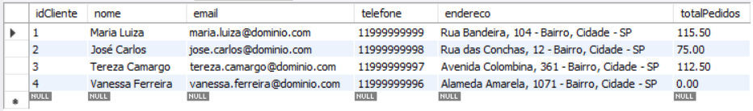
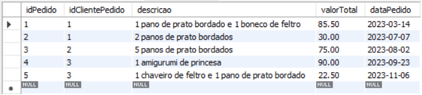
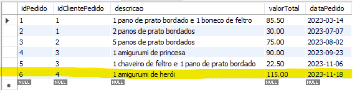
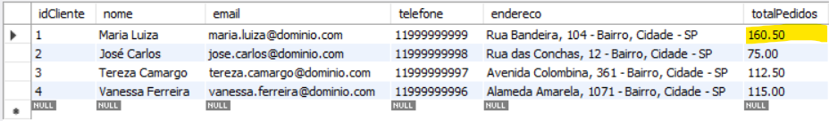
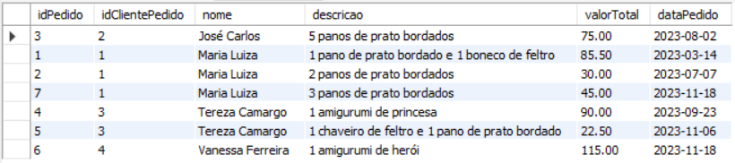
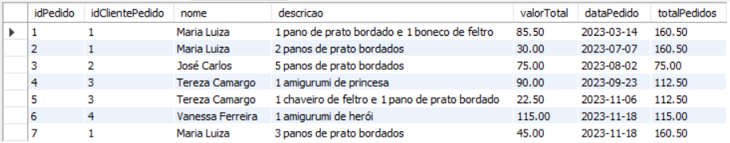

# Atividade individual - Tema: Sistema de Gerenciamento de Pedidos

**Objetivo:** Criar um sistema de gerenciamento de pedidos em um banco de dados utilizando stored procedures, triggers, views e JOINs no MySQL Workbench.

### Etapa 1: Criação de Tabelas e Inserção de Dados

Crie as tabelas "Clientes" e "Pedidos" com campos apropriados. Insira dados de exemplo nas tabelas para simular clientes e pedidos. Certifique-se de incluir uma chave primária em cada tabela.

```
create database gerenciamento_pedidos;
use gerenciamento_pedidos;

create table clientes (
	idCliente int primary key auto_increment,
    nome varchar (80) not null,
    email varchar (100) not null,
    telefone varchar (11),
    endereco varchar (200) not null,
    totalPedidos int (4) default 0
);

create table pedidos (
	idPedido int primary key auto_increment,
    idClientePedido int references clientes (idCliente),
    descricao varchar (200) not null,
    valorTotal decimal (10,2) not null,
    dataPedido date
);

insert into clientes (nome, email, telefone, endereco)
values ('Maria Luiza', 'maria.luiza@dominio.com', '11999999999', 'Rua Bandeira, 104 - Bairro, Cidade - SP'),
('José Carlos', 'jose.carlos@dominio.com', '11999999998', 'Rua das Conchas, 12 - Bairro, Cidade - SP'),
('Tereza Camargo', 'tereza.camargo@dominio.com', '11999999997', 'Avenida Colombina, 361 - Bairro, Cidade - SP'),
('Vanessa Ferreira', 'vanessa.ferreira@dominio.com', '11999999996', 'Alameda Amarela, 1071 - Bairro, Cidade - SP');

insert into pedidos (idClientePedido, descricao, valorTotal, dataPedido)
values (1, '1 pano de prato bordado e 1 boneco de feltro', 85.50, '2023-03-14'),
(1, '2 panos de prato bordados', 30, '2023-07-07'), (2, '5 panos de prato bordados', 75, '2023-08-02'),
(3, '1 amigurumi de princesa', 90, '2023-09-23'), (3, '1 chaveiro de feltro e 1 pano de prato bordado', 22.50, '2023-11-06');

update clientes set totalPedidos = 2 where idCliente = 1;
update clientes set totalPedidos = 1 where idCliente = 2;
update clientes set totalPedidos = 2 where idCliente = 3;

select * from clientes;
```


```
select * from pedidos;
```


### Etapa 2: Criação de Stored Procedure

Crie uma stored procedure chamada "InserirPedido" que permite inserir um novo pedido na tabela "Pedidos" com as informações apropriadas. A stored procedure deve receber parâmetros como o ID do cliente e os detalhes do pedido. Ao término teste o funcionamento da stored procedure criada inserindo um pedido.

```
delimiter $$
create procedure InserirPedido (
	in cliente int,
    in descricaoPedido varchar (200),
    in valorPedido decimal (10,2),
    in data_pedido date
)
begin
  insert into pedidos (idClientePedido, descricao, valorTotal, dataPedido)
  values (cliente, descricaoPedido, valorPedido, data_pedido);
end $$
delimiter ;

call InserirPedido (4, '1 amigurumi de herói', 115, now());

select * from pedidos;
```


### Etapa 3: Trigger

Crie uma trigger que seja acionada APÓS a inserção de um novo pedido na tabela "Pedidos". A trigger deve calcular o valor total dos pedidos para o cliente correspondente e atualizar um campo "TotalPedidos" na tabela "Clientes" com o valor total. Teste a Trigger inserindo um novo pedido na tabela "Pedidos".

```
delimiter $$
create trigger AtualizarTotalPedidos
after insert on pedidos
for each row
begin
	update clientes set totalPedidos = totalPedidos + NEW.valorTotal
	WHERE idCliente = NEW.idClientePedido;
end $$
delimiter ;

call InserirPedido (1, '3 panos de prato bordados', 45, now());

select * from clientes;
```


### Etapa 4: View

Crie uma view chamada "PedidosClientes" que combina informações das tabelas "Clientes" e "Pedidos" usando JOIN para mostrar os detalhes dos pedidos e os nomes dos clientes.

```
create view PedidosClientes as
	select p.idPedido, c.nome, p.descricao, p.valorTotal, p.dataPedido
	from pedidos p inner join clientes c on p.idClientePedido = c.idCliente
	order by c.nome;
```


### Etapa 5: Consulta com JOIN

Escreva uma consulta SQL que utiliza JOIN para listar os detalhes dos pedidos de cada cliente, incluindo o nome do cliente e o valor total de seus pedidos. Utilize a view "PedidosClientes" para essa consulta.

```
select p.*, c.totalPedidos from PedidosClientes p
inner join clientes c on p.idClientePedido = c.idCliente;
```

