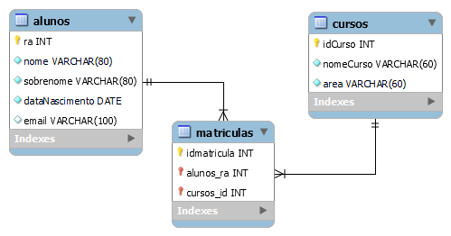
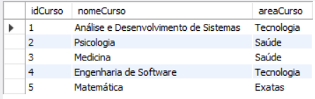
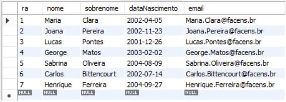
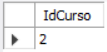
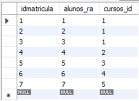
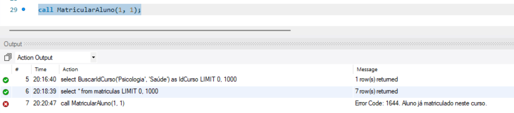

# Atividade individual - Tema: Sistema Universidade

CONFORME A AULA 11 SIGA OS ITENS ABAIXO PARA REALIZAÇÃO DA ATIVIDADE:

<ul>
    <li>Crie um banco de dados para armazenar alunos e cursos de uma universidade;</li>
    <li>Cada curso pode pertencer a somente uma área;</li>
    <li>Utilize Stored Procedures para automatizar a inserção e seleção dos cursos;</li>
    <li>O aluno possui um e-mail que deve ter seu endereço gerado automaticamente no seguinte formato: nome.sobrenome@dominio.com</li>
    <li>Crie uma rotina que recebe os dados de um novo curso e o insere no banco de dados;</li>
    <li>Crie uma função que recebe o nome de um curso e sua área, em seguida retorna o id do curso;</li>
    <li>Crie uma procedure que recebe os dados do aluno e de um curso e faz sua matrícula;</li>
    <li>Caso o aluno já esteja matriculado em um curso, essa matrícula não pode ser realizada;</li>
    <li>Crie o modelo lógico do exercício.</li>
</ul>

### Modelo lógico


### Criação das tabelas
```
create database universidade;
use universidade;

create table alunos (
	ra int primary key auto_increment,
    nome varchar(80) not null,
    sobrenome varchar(80) not null,
    dataNascimento date not null,
    email varchar(100)
);

create table cursos (
	idCurso int primary key auto_increment,
    nomeCurso varchar(60),
    areaCurso varchar(60)
);

create table matriculas (
	idmatricula int primary key auto_increment,
    alunos_ra int references alunos(ra),
    cursos_id int references cursos(idCurso)
);
```

### Stored Procedures para automatizar a inserção e seleção dos cursos
```
delimiter $
create procedure InserirCurso (nomeCurso varchar(60), areaCurso varchar(60))
begin
    insert into cursos (nomeCurso, areaCurso) values (nomeCurso, areaCurso);
end$
delimiter ;

delimiter $
create procedure SelecionarCursos()
begin
    select * from cursos;
end$
delimiter ;

call InserirCurso ('Análise e Desenvolvimento de Sistemas', 'Tecnologia');
call InserirCurso ('Psicologia', 'Saúde');
call InserirCurso ('Medicina', 'Saúde');
call InserirCurso ('Engenharia de Software', 'Tecnologia');
call InserirCurso ('Matemática', 'Exatas');
call SelecionarCursos();
```


### O aluno possui um e-mail que deve ter seu endereço gerado automaticamente no seguinte formato: nome.sobrenome@dominio.com

```
delimiter $
create trigger gerarEmail before insert on alunos for each row
begin
	declare contadorEmail int;
	set contadorEmail = 0;
  
	select count(*) into contadorEmail from alunos where email = CONCAT(NEW.nome, '.', NEW.sobrenome, '@facens.br');
  
	if contadorEmail > 0 then
		set NEW.email = CONCAT(NEW.nome, '.', NEW.sobrenome, contadorEmail, '@facens.br');
	else
		set NEW.email = CONCAT(NEW.nome, '.', NEW.sobrenome, '@facens.br');
	end if;
end $
delimiter ;
```


### Crie uma função que recebe o nome de um curso e sua área, em seguida retorna o id do curso

```
delimiter $
create function BuscarIdCurso(nomeCurso varchar(60), areaCurso varchar(60))
	returns int deterministic
begin
	select idCurso INTO @curso_id from cursos
		where cursos.nomeCurso = nomeCurso AND cursos.areaCurso = areaCurso;
	return @curso_id;
end $
delimiter ;

select BuscarIdCurso('Psicologia', 'Saúde') as IdCurso;
```


### Crie uma procedure que recebe os dados do aluno e de um curso e faz sua matrícula

```
delimiter $
create procedure MatricularAluno(ra int, idCurso int)
begin
	if exists (select 1 from matriculas where ra = alunos_ra and idCurso = cursos_id) then
		SIGNAL SQLSTATE '45000'
		set message_text = 'Aluno já matriculado neste curso.';
	else
		insert into matriculas (idmatricula, alunos_ra, cursos_id)
		values (null, ra, idCurso);
	end if;
end $
delimiter ;

call MatricularAluno(1, 1);
call MatricularAluno(2, 1);
call MatricularAluno(3, 1);
call MatricularAluno(4, 2);
call MatricularAluno(5, 3);
call MatricularAluno(6, 4);
call MatricularAluno(7, 5);
select * from matriculas;
```


### Caso o aluno já esteja matriculado em um curso, essa matrícula não pode ser realizada

