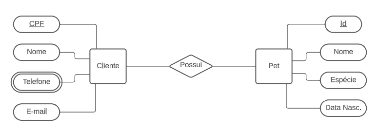
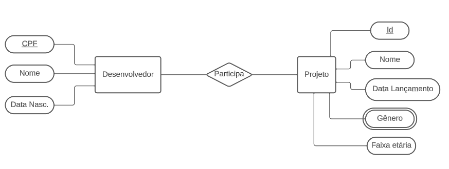
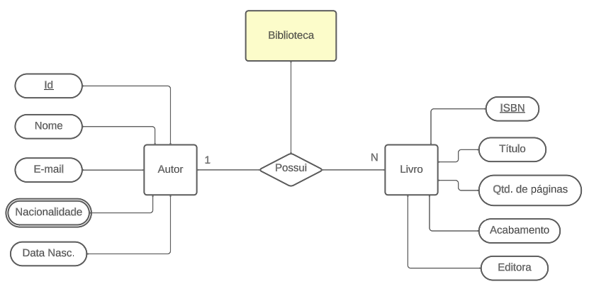
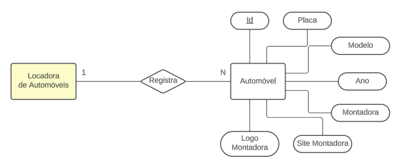
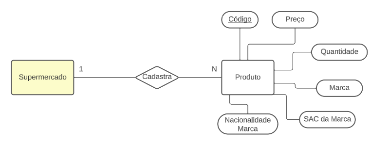
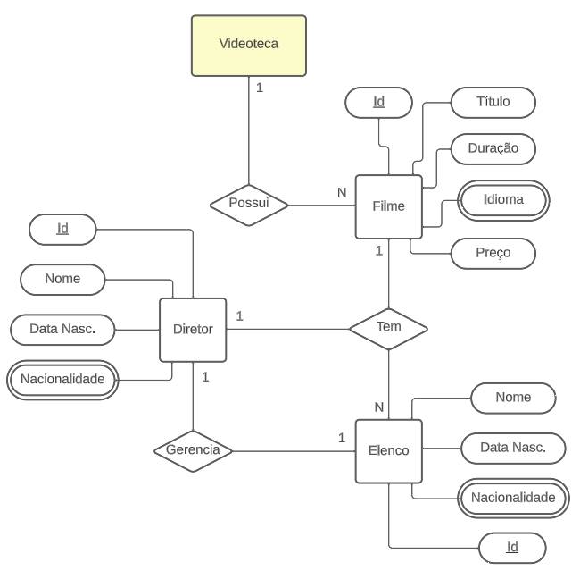

# Banco de Dados

### AC1
- Crie um modelo de dados para os cenários a seguir. Após a criação dos MER, crie as bases de dados de cada um dos exercícios dados, inserindo também os dados necessários para compor a base de dados criada.


#### 1. PETSHOP
Um petshop deseja manter cadastrados seus clientes bem como seus pets. Um cliente deve informar seu nome, cpf, email e telefone além do nome, espécie e data de nascimento de seu pet.



```
CREATE TABLE pet (
  id varchar (6) PRIMARY KEY,
  nome varchar (50),
  especie varchar (10),
  data_nascimento date
);
  
CREATE TABLE cliente (
  cpf varchar (11) PRIMARY KEY,
  nome varchar (50),
  telefone varchar (11),
  email varchar (100),
  id_pet varchar (6),
  FOREIGN KEY(id_pet) REFERENCES pet(id)
);
  
INSERT INTO pet (id, nome, especie, data_nascimento) 
VALUES ('000001', 'Félix', 'Gato SRD', '2015-04-09'),
('000002', 'Thor', 'Cachorro', '2019-02-23'),
('000003', 'Tintin', 'Cachorro', '2020-07-01');
  
INSERT INTO cliente (cpf, nome, telefone, email, id_pet) 
VALUES ('11111111122', 'Michael Scott', '11999999898', 'michael.scott@email.com', '000001'),
('22222222233', 'Pam Basley', '15988888989', 'pam.basley@email.com', '000002'),
('33333333344', 'Bob Vance', '159999707979', 'bob.vance@vancerefrigeration.com', '000003');
  
SELECT * FROM cliente c INNER JOIN pet p on p.id = c.id_pet;
```

#### 2. Produtora de Games
Em uma produtora de games, há desenvolvedores, que possuem um nome, cpf, data de nascimento. Cada projeto tem um nome, data de lançamento, gênero e faixa etária. Segundo o gerente de projetos, “cada desenvolvedor deve estar envolvido em um projeto”.



```
CREATE TABLE projeto (
  id varchar (4) PRIMARY KEY,
  nome varchar (50),
  genero varchar (20),
  faixa_etaria int (2),
  data_lancamento date
);

CREATE TABLE desenvolvedor (
  cpf varchar (11) PRIMARY KEY,
  nome varchar (50),
  data_nascimento date,
  id_projeto varchar (4),
  FOREIGN KEY(id_projeto) REFERENCES projeto(id)
);
  
INSERT INTO projeto (id, nome, genero, faixa_etaria, data_lancamento) 
VALUES ('0001', 'Bang Bang', 'Tiro', 12, '2023-04-09'),
('0002', 'Thor: Amor e Trovão', 'Ação', 14, '2024-02-23'),
('0003', 'Candy Crush', 'Plataforma', 10, '2025-07-01');
  
INSERT INTO desenvolvedor (cpf, nome, data_nascimento, id_projeto) 
VALUES ('11111111122', 'Michael Scott', '1995-06-30', '0001'),
('22222222233', 'Pam Basley', '1999-02-15', '0002'),
('33333333344', 'Bob Vance', '1990-03-21', '0003');
  
SELECT * FROM projeto p INNER JOIN desenvolvedor d on p.id = d.id_projeto;
```

#### 3. Biblioteca
Uma biblioteca faz registro de autores e livros. Um autor é cadastrado com seu nome, e-mail, nacionalidade e data de nascimento. Já um livro é registrado com o título, quantidade de páginas, acabamento e editora.



```
CREATE TABLE autor (
  id varchar (4) PRIMARY KEY,
  nome varchar (50),
  email varchar (50),
  nacionalidade varchar (50),
  data_nascimento date
);

CREATE TABLE livro (
  isbn varchar (10) PRIMARY KEY,
  titulo varchar (100),
  qtd_paginas int (4),
  acabamento varchar (20),
  editora varchar (30),
  id_autor varchar (4),
  FOREIGN KEY(id_autor) REFERENCES autor(id)
);
  
INSERT INTO autor (id, nome, email, nacionalidade, data_nascimento) 
VALUES ('0001', 'José Moreto', 'jose.moreto@email.com', 'Brasileiro', '1995-06-30'),
('0002', 'Carla Dias', 'carla.dias@email.com', 'Brasileira', '1999-02-15'),
('0003', 'John Mayer', 'john.mayer@email.com', 'Americano', '1990-03-21');
  
INSERT INTO livro (isbn, titulo, qtd_paginas, acabamento, editora, id_autor) 
VALUES ('1111111112', 'A Dinâmica', 223, 'Brochura', 'Estante', '0001'),
('2222222223', 'Amor e Trevas', 150, 'Brochura', 'Estante', '0002'),
('3333333334', 'Como Tudo Começou', 285, 'Brochura', 'Estante', '0003');
  
SELECT * FROM livro l INNER JOIN autor a on a.id = l.id_autor;
```

#### 4. Locadora de Automóveis
Uma locadora de automóveis, mantém registro dos automóveis. Um automóvel é cadastrado com placa, modelo, ano, nome da montadora, site da montadora,  logotipo da montadora.



```
CREATE TABLE automovel (
  id varchar (6) PRIMARY KEY,
  placa varchar (10),
  modelo varchar (20),
  ano int (4),
  montadora varchar (20),
  site_montadora varchar (200),
  logo_montadora varchar (200)
);
  
INSERT INTO automovel (id, placa, modelo, ano, montadora, site_montadora, logo_montadora) 
VALUES ('000001', 'BOB1234', 'Onix', 2024, 'Chevrolet', 'https://www.chevrolet.com.br/', 'logochevrolet.png'),
('000002', 'BYE1887', 'Gol', 2021, 'Volkswagen', 'https://www.vw.com.br/pt.html', 'logovw.png'),
('000003', 'CAR9555', 'HB20', 2015, 'Hyundai', 'https://hyundai.com.br/', 'logohyundai.png');
  
SELECT * FROM automovel;
```

#### 5. Supermercado
Um supermercado cadastra seus produtos. Um produto é identificado por seu nome, preço, quantidade em estoque, nome da marca, SAC da marca, nacionalidade da marca.



` Aqui vai o script SQL ` 

#### 6. Videoteca
Uma videoteca precisa cadastrar o título, duração, idioma original e preço de cada filme. É necessário cadastrar também o elenco de cada filme onde se registra o nome, data de nascimento, nacionalidade de cada ator/atriz. Opcionalmente, inclua o cadastro de diretores com atributos que julgar necessários.



` Aqui vai o script SQL ` 

### Exercícios disponibilizados na aula do dia 04/09/2023:

1 — Crie um banco de dados para armazenar dados de alunos. Um aluno deve ter RA, nome, data de nascimento, endereço e e-mail;

2 — Crie um banco de dados para armazenar dados de colaboradores de uma empresa. Um colaborador deve ter um código de identificação, nome, CPF, cargo e salário;

Insira pelo menos 5 registros em cada tabela;

Selecione os dados.

#### 1 - Tabela Aluno

```
CREATE TABLE aluno (
  RA varchar (6),
  nome varchar (50),
  data_nascimento varchar (10),
  endereco varchar (120),
  email varchar (50)
  );
  
  INSERT INTO aluno (RA, nome, data_nascimento, endereco, email) 
  VALUES ('172008', 'Juliana', '15/02/1999', 'alameda franca, 1071 - Nova Sorocaba', 'juliana@gmail.com'),
  ('172009', 'Camila', '20/01/1999', 'francisco bueno, 472 - Ana Maria', 'camila@gmail.com'),
  ('172010', 'André Felipe', '02/04/1997', 'rua das flores, 83 - Vila jardim', 'andrefelipe@gmail.com'),
  ('172011', 'Jorge Henrique', '14/12/2000', 'rua principal, 12 - Jd. Cidade', 'jorge@hotmail.com'),
  ('172012', 'Priscila', '28/05/1998', 'avenida carreto, 54 - Bairro 13', 'priscila@hotmail.com');
  
  SELECT * FROM aluno;
  ```

#### 2 - Tabela Colaboradores

```
CREATE TABLE colaboradores (
  id int(6),
  nome varchar(50),
  cpf varchar(12),
  cargo varchar(50),
  salario decimal(10,2)
);

INSERT INTO colaboradores (id, nome, cpf, cargo, salario)
VALUES (101010, 'Ana Paula Padrão', '00011122233', 'Assistente', 3200.00),
(111111, 'Marcia Teixeira', '11122233344', 'Gerente', 15000.00),
(121212, 'Paulo André Alves', '22233344455', 'Assistente', 3000.00),
(131313, 'Joao Marcelo Silva', '33344455566', 'Auxiliar I', 4350.50),
(141414, 'Luis Felipe Ferreira', '44455566677', 'Auxiliar II', 4730.20);

SELECT * FROM colaboradores;
```
