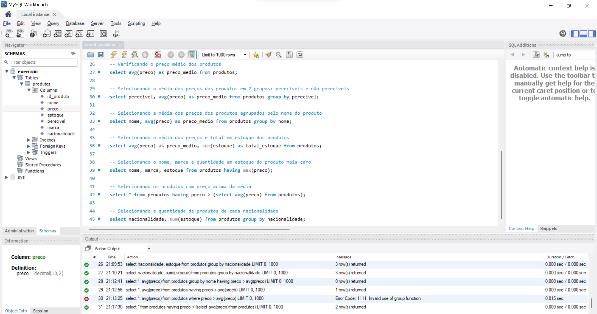

# Banco de Dados

- Acesse a pasta com os [arquivos da AC2](https://github.com/Juliana-Ferreira/BD_2023/tree/main/AC2).

### Etapa 1
Crie uma tabela Produtos com os seguintes itens id_produto; nome; preço; estoque; perecível; marca; nacionalidade;

Atribua a cada campo seu respectivo tipo;

Os itens: nome; preço; estoque; perecível não poderão receber valores nulos;

O id_produto deve ser utilizado como chave-primaria;

Após a criação insira cinco produtos, todos devem ter seus respectivos campos preenchidos;

Verifique se todos os dados foram inseridos.

```
-- Criando o banco de dados
create database exercicio;

-- Criando a tabela de produtos com as respectivas colunas
create table Produtos (
	id_produto int(8) primary key auto_increment,
    nome varchar(50) not null,
    preco decimal(10,2) not null,
    estoque int(10) not null,
    perecivel char not null,
    marca varchar(50),
    nacionalidade varchar(80)
);

-- Inserindo dados na tabela
insert into Produtos(nome, preco, estoque, perecivel, marca, nacionalidade)
values ("Arroz branco", 28.50, 135, 'N', "Tio João", "Brasileiro"),
("Feijão preto", 8.45, 240, 'N', "Kicaldo", "Brasileiro"),
("Leite", 5.20, 786, 'S', "Itambé", "Brasileiro"),
("Macarrão", 14.80, 314, 'N', "Barilla", "Italiano"),
("Tomate", 8.90, 863, 'S', null, null);
```

### Etapa 2
Gere um [relatório](https://github.com/Juliana-Ferreira/BD_2023/blob/main/AC2/relatorio_qtd_produtos.csv) informando quantos produtos estão cadastrados;

Gere um [relatório](https://github.com/Juliana-Ferreira/BD_2023/blob/main/AC2/relatorio_preco_medio.csv) informando o preço médio dos produtos;

Selecione a média dos preços dos produtos em 2 grupos: perecíveis e não perecíveis;

Selecione a média dos preços dos produtos agrupados pelo nome do produto;

Selecione a média dos preços e total em estoque dos produtos;

Selecione o nome, marca e quantidade em estoque do produto mais caro;

Selecione os produtos com preço acima da média;

Selecione a quantidade de produtos de cada nacionalidade.

```
-- Verificando quantos produtos estão cadastrados
select count(id_produto) from produtos;

-- Verificando o preço médio dos produtos
select avg(preco) as preco_medio from produtos;

-- Selecionando a média dos preços dos produtos em 2 grupos: perecíveis e não perecíveis
select perecivel, avg(preco) as preco_medio from produtos group by perecivel;

-- Selecionando a média dos preços dos produtos agrupados pelo nome do produto
select nome, avg(preco) as preco_medio from produtos group by nome;

-- Selecionando a média dos preços e total em estoque dos produtos
select avg(preco) as preco_medio, sum(estoque) as total_estoque from produtos;

-- Selecionando o nome, marca e quantidade em estoque do produto mais caro
select nome, marca, estoque from produtos having max(preco);

-- Selecionando os produtos com preço acima da média
select * from produtos having preco > (select avg(preco) from produtos);

-- Selecionando a quantidade de produtos de cada nacionalidade
select nacionalidade, sum(estoque) from produtos group by nacionalidade;
```

### Print da tela do WorkBench

